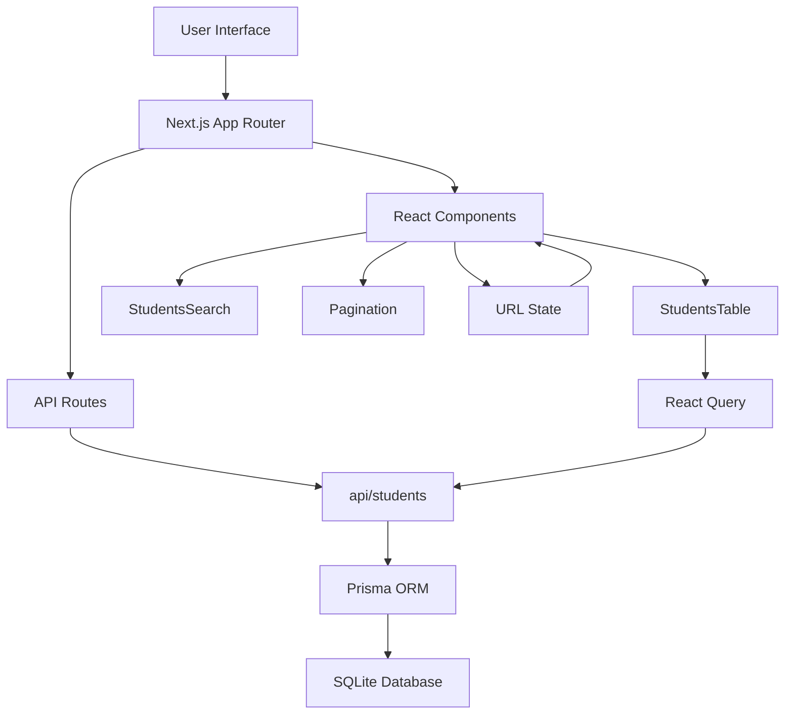
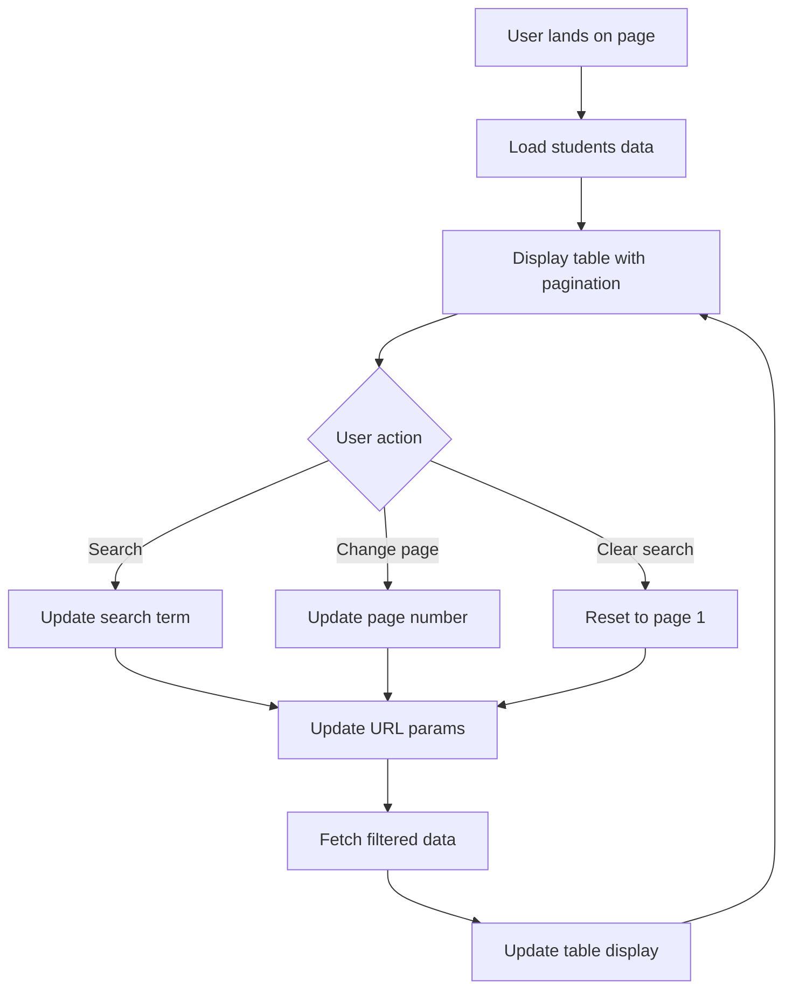

First of all, I want to introduce a little bit about me and my background knowledge, so maybe my work plan will make more sense on my decisions and other choices. I am a SWE with approximately 2 years of experience, mainly work on the front-end side, limited experience on the backend side.

When approaching this challenge, after seeing the figma file and the introductions as well as the time constraint, I would choose these technologies for my solution.

## Tech stack and Libraries used

### Frontend & Backend Framework
- **Next.js** - Full-stack React framework
  - **Server-side rendering (SSR)** for better performance and SEO
  - **API routes** allow building backend endpoints within the same project
  - **App Router** provides modern routing with better developer experience
  - **Built-in optimization** for images, fonts, and performance
  - **TypeScript support** out of the box for better code quality

### UI Library
- **shadcn/ui** - Modern component library
  - **Copy-paste components** that are fully customizable and owned by the project
  - **Built on Radix UI** providing accessible, unstyled primitives
  - **Tailwind CSS integration** for consistent styling and rapid development
  - **TypeScript-first** with excellent type safety
  - **No runtime dependencies** - components become part of your codebase

### Additional Libraries
- **Tailwind CSS** - Utility-first CSS framework for rapid styling
- **Prisma** - Type-safe database ORM for data management
- **React Query (TanStack Query)** - Powerful data fetching and caching library
- **Lucide React** - Beautiful, customizable icon library

### Why these choices?
Given the time constraint and project requirements, this stack provides:
1. **Rapid development** - shadcn/ui components and Tailwind allow quick UI implementation
2. **Full-stack capability** - Next.js API routes eliminate the need for separate backend setup
3. **Type safety** - TypeScript throughout the stack reduces bugs and improves developer experience
4. **Modern practices** - Following current industry standards and best practices
5. **Scalability** - Architecture that can grow with the application needs

In short, I picked shadcn ui library for its flexibility, quick UI implementation and customizable component. I chose NextJS because I can do both front-end and back-end in this repo.

## Trade-offs

Because of the time constraint, I decided to focus on the Student List Table feature. I think it is the most important component on this page so I will prioritize the Student List Table first, and if I still have more time, I would work on the two remaining features. 
The two remaining features, I may need to perform some calculations on the backend side, I have not been familiar with that so it would cost a lot of my time. I decided to work on these two features if I still have time.

### What would I do differently in a production environment and if I have more time

In a production environment, I would implement several improvements:

**Code Quality & Architecture:**
- **Global style** - Add primary, secondary color, text color, shades to reuse and make change in one place
- **Loading states** - More sophisticated loading states
- **Component testing** - Add comprehensive unit and integration tests using Jest/React Testing Library

**Performance Optimizations:**
- **Caching strategies** - Implement Redis or similar for API response caching

## Implementation idea and Work plan

### Application Architecture



### User Flow



### My Plan

**Core Student Table Feature (Completed)**
1. **Styling** - Add custom color variables to the global css file to reuse and make change in one place
2. **API Development** - Built `/api/students` endpoint with search and pagination
3. **UI Components** - Implemented reusable components:
   - `StudentsTable` - Main data display with searching and pagination
   - `StudentsSearch` - Search functionality with real-time filtering
   - `Pagination` - Custom pagination component
4. **State Management** - Used React Query for efficient data fetching and caching
5. **URL Management** - Implemented URL parameter sync for search and pagination state

**Key Features Delivered:**
- ✅ Student list with company, course, and progress information
- ✅ Progress visualization with color-coded bars. Since I work on the Student List Table only, I would show the color according to the progress percentage. I noticed that, in the figma design, the colors seem to be following the company. Because I focus on the Student List Table, I would use colors according to the amount of progress. 
- ✅ Real-time search functionality
- ✅ Pagination with URL state management
- ✅ Loading states and error handling

### What I would implement with more time

**Stat cards and Engagement chart (Next Priority)**
- **Stat cards** - Summary cards showing:
  - Total students enrolled
  - Recent activity metrics
- **Progress Charts** - Visual charts using Recharts:
  - Completion trends over time
  - Course performance comparison

**Enhanced Features**
- **Advanced Filtering** - Multi-select filters for:
  - Course, Company
  - Progress ranges
  - Last activity timeframes
- **Export Functionality** - CSV/Excel export of filtered student data
- **Student Detail View** - Modal or separate page with detailed student information

## Getting Started

First, run the development server:

```bash
npm run dev
# or
yarn dev
# or
pnpm dev
# or
bun dev
```

Open [http://localhost:3000](http://localhost:3000) with your browser to see the result.

You can start editing the page by modifying `app/page.tsx`. The page auto-updates as you edit the file.

This project uses [`next/font`](https://nextjs.org/docs/app/building-your-application/optimizing/fonts) to automatically optimize and load [Geist](https://vercel.com/font), a new font family for Vercel.

## Deploy on Vercel

The easiest way to deploy your Next.js app is to use the [Vercel Platform](https://vercel.com/new?utm_medium=default-template&filter=next.js&utm_source=create-next-app&utm_campaign=create-next-app-readme) from the creators of Next.js.

Check out our [Next.js deployment documentation](https://nextjs.org/docs/app/building-your-application/deploying) for more details.
